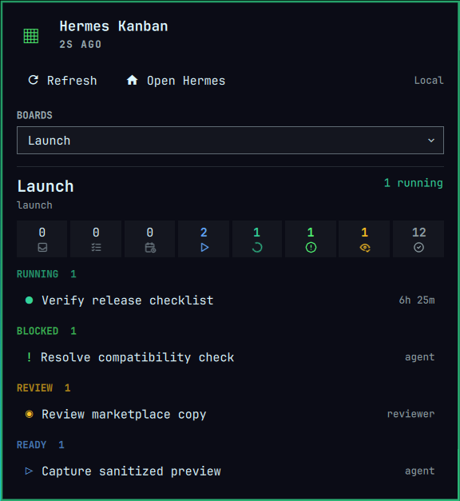

# Hermes Kanban for Omarchy

A read-only Omarchy Quattro bar widget for monitoring selected Hermes Kanban boards. Hermes may run locally or on a remote host reached through an existing OpenSSH configuration.



The panel shows aggregate workflow counts and the running, blocked, review, and ready tasks for any number of selected boards. Local mode is the safe default. Task bodies are excluded unless explicitly enabled.

Board summaries use bundled, theme-colored [Tabler Icons](assets/tabler/README.md)
for each Hermes status, so they remain legible without relying on a particular
Nerd Font. Hover an icon to see its full status label and count.

## Requirements

- Omarchy Quattro with `omarchy-shell`
- Hermes Agent 0.20 or newer on the selected host
- Python 3 locally and, for Remote mode, on the remote host
- OpenSSH client and non-interactive public-key authentication for Remote mode

The plugin uses only Python's standard library. It does not install packages, create services, request privileges, or manage SSH keys.

## Install

```bash
omarchy plugin add https://github.com/davidojedalopez/omarchy-hermes-kanban.git --enable
```

The permanent plugin ID is `io.github.davidojedalopez.hermes-kanban`.

## Configure

Open Omarchy's bar settings and configure the Hermes Kanban widget:

- **Hermes host:** `Local` or `Remote`; defaults to `Local`.
- **Hermes executable:** `hermes` or an absolute executable path on the selected host.
- **Remote SSH host:** an OpenSSH host or alias, used only in Remote mode.
- **Show task bodies:** off by default to minimize task content entering the shell.
- **Refresh intervals:** 15 seconds while open and 120 seconds in the background by default.

Board selection is available inside the panel and is stored separately for each local or remote endpoint.

### Remote setup

Create and test the host in `~/.ssh/config` yourself. The plugin never changes SSH configuration or accepts a host key on your behalf.

```sshconfig
Host hermes-workstation
    HostName example.internal
    User your-user
    IdentityFile ~/.ssh/id_ed25519
    IdentitiesOnly yes
```

Verify the host key and unlock the key interactively before enabling Remote mode:

```bash
ssh hermes-workstation true
ssh -o BatchMode=yes hermes-workstation '/absolute/path/to/hermes version'
```

If the key is encrypted, load it into your existing SSH agent with `ssh-add`. The plugin honors `SSH_AUTH_SOCK` and can also discover Omarchy's standard `$XDG_RUNTIME_DIR/ssh-agent.socket`; it never reads a private key itself.

## Controls

- Left click: open or close the progress panel
- Middle or right click: refresh
- `R` while open: refresh
- `O` while open: launch the local Hermes Desktop application
- Task row: expand details and copy the task ID

Selection state is stored at `~/.local/state/omarchy/hermes-kanban.json`. Task snapshots stay in memory and are not written to disk.

## Security model

Omarchy plugins run unsandboxed with the current user's permissions. This plugin narrows its runtime behavior as follows:

- Executes only `hermes kanban boards list --json` and `hermes kanban --board SLUG list --json`.
- Invokes Hermes without a local shell.
- Encodes Remote-mode request data before it reaches the remote login shell.
- Requires strict host-key checking and public-key, non-interactive SSH authentication.
- Disables TTYs, passwords, keyboard-interactive authentication, agent/X11/port forwarding, local commands, and SSH connection sharing.
- Allowlists board and task fields, filters task details to active workflow states, removes control characters, and caps inputs, strings, tasks, command output, and final snapshots.
- Renders Hermes-derived strings as plain text.
- Converts command failures into stable messages instead of showing raw remote stderr.

The configured OpenSSH host entry remains trusted user configuration. It may intentionally contain a `ProxyJump` or `ProxyCommand`; review it before allowing an unsandboxed plugin to use it. See [SECURITY.md](SECURITY.md) for reporting and trust boundaries.

## Remove

```bash
omarchy plugin remove io.github.davidojedalopez.hermes-kanban
```

Removing the plugin does not delete its board-selection state. Remove it separately if desired:

```bash
gio trash ~/.local/state/omarchy/hermes-kanban.json
```

## Development

```bash
tests/run.sh
omarchy plugin validate .
qmllint -I /usr/lib/qt6/qml -I /usr/share/omarchy/shell \
  BarWidget.qml Panel.qml SnapshotStore.qml
```

The test suite covers local and remote transports, exact SSH guardrails, schema and state migration, data minimization, command validation, and the QML model.
